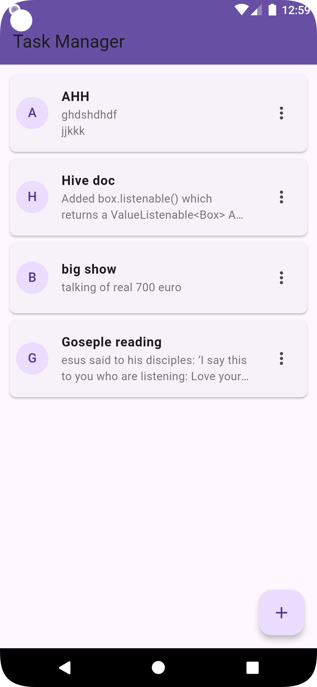
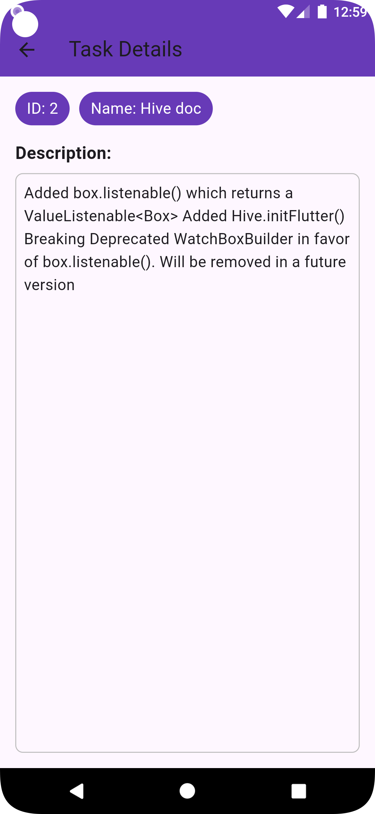
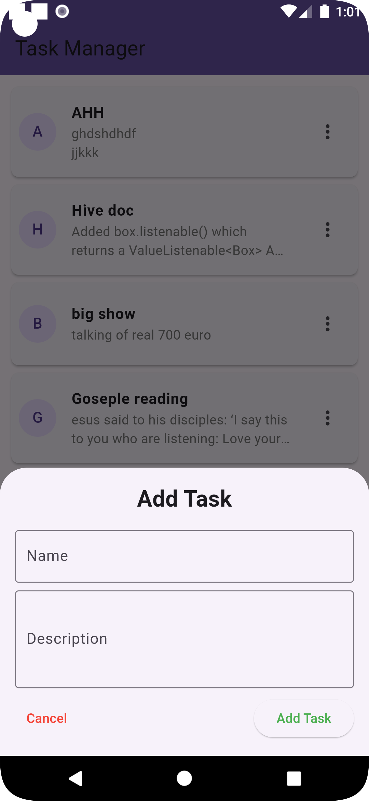
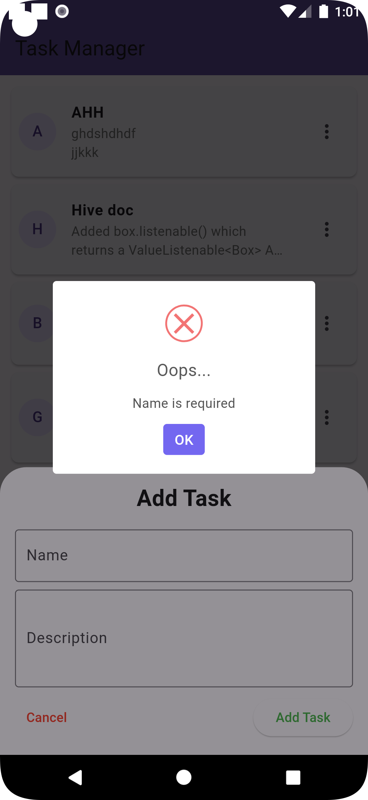
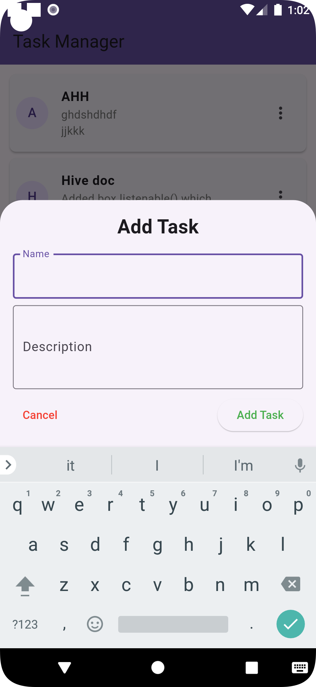
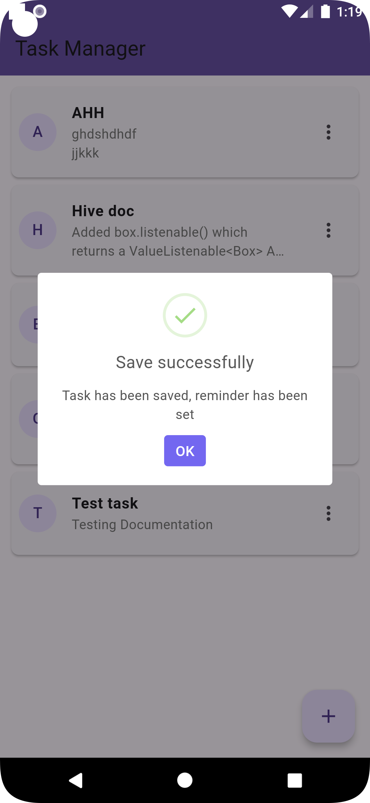
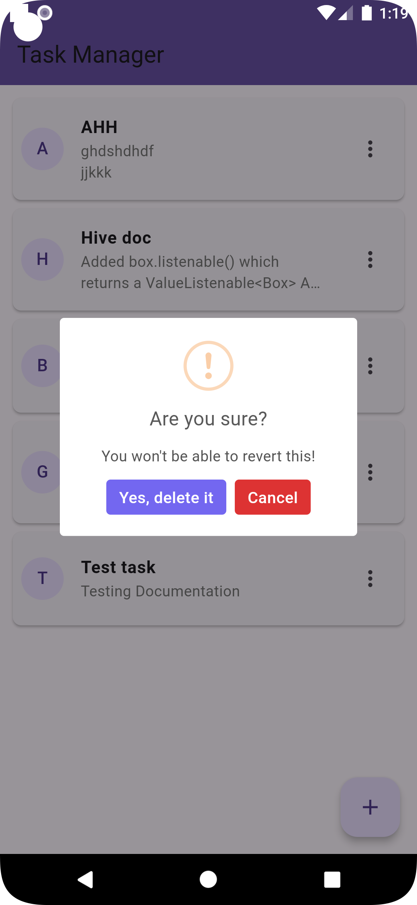
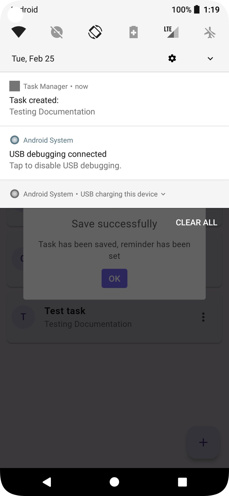
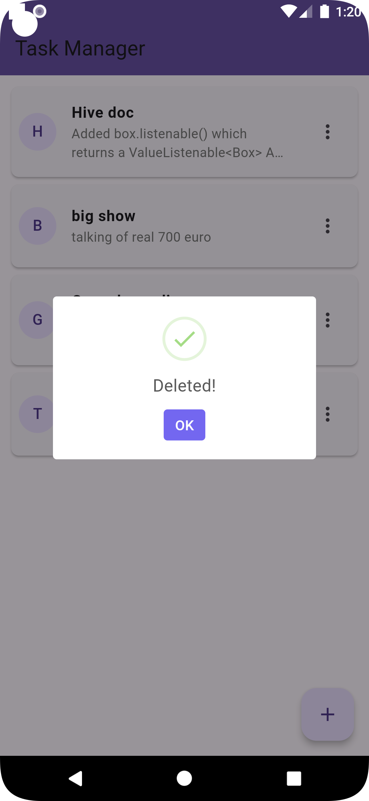

# Task management

Task Management App with notification 

A simple Flutter application that demonstrates the following functionalities:

1. Task Management: Allow users to create, edit, and delete tasks.
2. Push Notifications: Send a reminder notification 5 minutes after a task is created.
3. Local Data Storage: Save tasks locally using   Hive. 

## Getting Started
**Running prebuild APK**
1. Install located in screenshots **[ screenshots/task_manager.apk ]** and test the app on your device or emulator.
2. Ensure you internet connection is on to receive notifications
3. You can test with two device to see the notification in action
4. User task are saved locally and can only be view once by others devices.

## Running the code.

**The following instructions will get you a copy of the project up and running on your local machine for development and testing purposes.**

1. cmd  `dart  run build_runner build` to generate HIVE the files // optional
### Configure Firebase Project

2. create a firebase project
3. login to firebase cli,  after it's installation 
4. Run cmd `firebase login`
5. Run cmd `dart pub global activate flutterfire_cli`
6. Run cmd `flutterfire configure --project=task-manager-6e79e` // note "project=task-manager-6e79e" is project id 
## configure oth keys 
**Configure firebase project using on screen instructions from firebase console during project creation**

7. under this   https://console.firebase.google.com/u/1/project/task-manager-6e79e/settings/serviceaccounts/adminsdk
replace this "task-manager-6e79e" with your firebase project id  and do the "step 8"

8. Generate a new private key and download it and rename it to k.json
'assets/k.json` to the root of the project

9. add google-services.json file from your firebase project(https://console.firebase.google.com/u/1/project/task-manager-6e79e/settings/general/android:com.example.task_management)
'android/google-services.json` to the root of the project
10. Run cmd  `flutter run` to run the app

####  "u/1/"    signify the user user in the url.

# Note
Sending notification require server side code to send the notification to the device which done on the App but should avoided

# Screeenshots

| Tasks list | Task detail  |  Add Task |
|-------------|------------------|-----------------------|
|  |  |  |

 
| fiail to add task | Add task with keyborad | Task saved message |
|-------------|------------|--------------------|
|  |  |  |
 
|Delete task | Task notification | Task deleted |
|-----------|--------------------|----------------|
|  |  |  |

---
